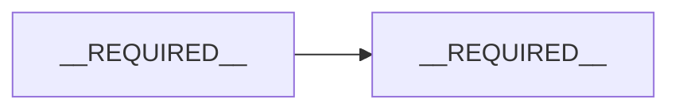

# {{TITLE}}

| Author | Status | Language | Created | Reviewers | Approver |
|---|---|---|---|---|---|
| {{AUTHOR}} | Draft | en | {{DATE}} | __REQUIRED__ | __REQUIRED__ |

## Gate status

| Gate | Status | Evidence | Confirmed by | Date |
|---|---|---|---|---|
| D0 Problem agreed | NOT_STARTED | — | — | — |
| D1 Design drafted | NOT_STARTED | — | — | — |
| D2 Reviewed | NOT_STARTED | — | — | — |
| D3 Approved | NOT_STARTED | — | — | — |

## Summary

__REQUIRED__ Three to five sentences: the problem, the proposed approach, the main tradeoff. A reviewer who reads only this knows what they are asked to approve.

## Context and problem

__REQUIRED__ What exists today, with file paths. What is wrong or missing. Why now.

## Goals

__REQUIRED__ What must be true when this is done, measurable where possible. Include the success measure and its target.

## Non-goals

__REQUIRED__ Things a reader could reasonably expect this to cover, which it deliberately does not.

## Constraints

__REQUIRED__ Deadlines, required or forbidden technologies, budgets, compliance requirements, and decisions already made above this doc.

## Proposed design

__REQUIRED__ Overview first, then detail: a system diagram, components and responsibilities, data model changes, API or interface changes, the main flows including failure paths.

## Alternatives considered

__REQUIRED__ Each real alternative: what it is, what it would cost, why it was not chosen. Include "do nothing" when that is a live option.

## Cross-cutting concerns

__REQUIRED__ Only the ones that apply: security and privacy, reliability and failure modes, performance and scale, cost, observability, accessibility, compliance. For ML or LLM designs: evaluation, data, model choice, failure behaviour.

## Rollout

__REQUIRED__ Feature flag, migration steps, backward compatibility, how to roll back.

## Testing

__REQUIRED__ How correctness is checked, at which level.

## Open questions

| Question | Who can answer | Needed by gate |
|---|---|---|
| __REQUIRED__ | __REQUIRED__ | __REQUIRED__ |

## Appendix: Review log

| Date | Reviewer | Comment (summary) | Decision | Reason |
|---|---|---|---|---|
| — | — | — | — | — |
