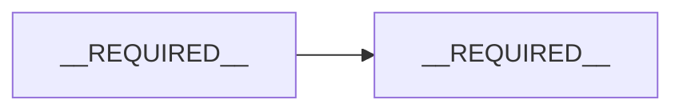

# {{TITLE}}

| Tác giả | Trạng thái | Ngôn ngữ | Ngày tạo | Reviewer | Người phê duyệt |
|---|---|---|---|---|---|
| {{AUTHOR}} | Draft | vi | {{DATE}} | __REQUIRED__ | __REQUIRED__ |

## Trạng thái gate

| Gate | Status | Bằng chứng | Xác nhận bởi | Ngày |
|---|---|---|---|---|
| D0 Thống nhất vấn đề | NOT_STARTED | — | — | — |
| D1 Hoàn thành bản thiết kế | NOT_STARTED | — | — | — |
| D2 Đã review | NOT_STARTED | — | — | — |
| D3 Đã phê duyệt | NOT_STARTED | — | — | — |

## Tóm tắt

__REQUIRED__ Ba đến năm câu: vấn đề, giải pháp đề xuất, tradeoff chính. Reviewer chỉ đọc phần này cũng biết mình được yêu cầu phê duyệt điều gì.

## Bối cảnh và vấn đề

__REQUIRED__ Hệ thống hiện tại ra sao, kèm đường dẫn file. Điều gì đang sai hoặc còn thiếu. Vì sao cần làm bây giờ.

## Mục tiêu

__REQUIRED__ Những điều phải đúng khi hoàn thành, đo lường được nếu có thể. Bao gồm chỉ số thành công và ngưỡng mục tiêu.

## Ngoài phạm vi

__REQUIRED__ Những điều người đọc có thể nghĩ là tài liệu này bao gồm, nhưng được loại ra có chủ đích.

## Ràng buộc

__REQUIRED__ Deadline, công nghệ bắt buộc hoặc bị cấm, ngân sách, yêu cầu compliance, và các quyết định đã được đưa ra ở cấp cao hơn.

## Thiết kế đề xuất

__REQUIRED__ Tổng quan trước, chi tiết sau: sơ đồ hệ thống, các thành phần và trách nhiệm, thay đổi data model, thay đổi API hoặc interface, các luồng chính kể cả luồng lỗi.

## Các phương án đã cân nhắc

__REQUIRED__ Mỗi phương án thực sự khả thi: nội dung, chi phí, lý do không chọn. Có "không làm gì" nếu đó là một lựa chọn thực tế.

## Các vấn đề xuyên suốt

__REQUIRED__ Chỉ những mục áp dụng: security và privacy, reliability và failure mode, performance và scale, chi phí, observability, accessibility, compliance. Với thiết kế có ML hoặc LLM: evaluation, dữ liệu, lựa chọn model, hành vi khi model sai.

## Triển khai

__REQUIRED__ Feature flag, các bước migration, tương thích ngược, cách rollback.

## Kiểm thử

__REQUIRED__ Cách kiểm tra tính đúng đắn, ở mức nào.

## Câu hỏi mở

| Câu hỏi | Ai trả lời được | Cần trước gate |
|---|---|---|
| __REQUIRED__ | __REQUIRED__ | __REQUIRED__ |

## Phụ lục: Nhật ký review

| Ngày | Reviewer | Nội dung góp ý (tóm tắt) | Quyết định | Lý do |
|---|---|---|---|---|
| — | — | — | — | — |
